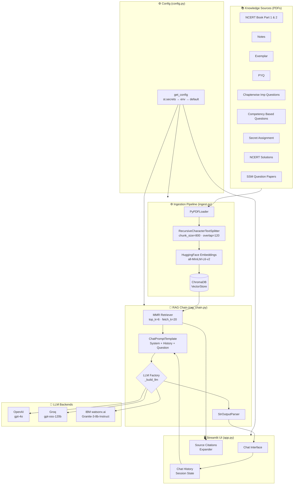
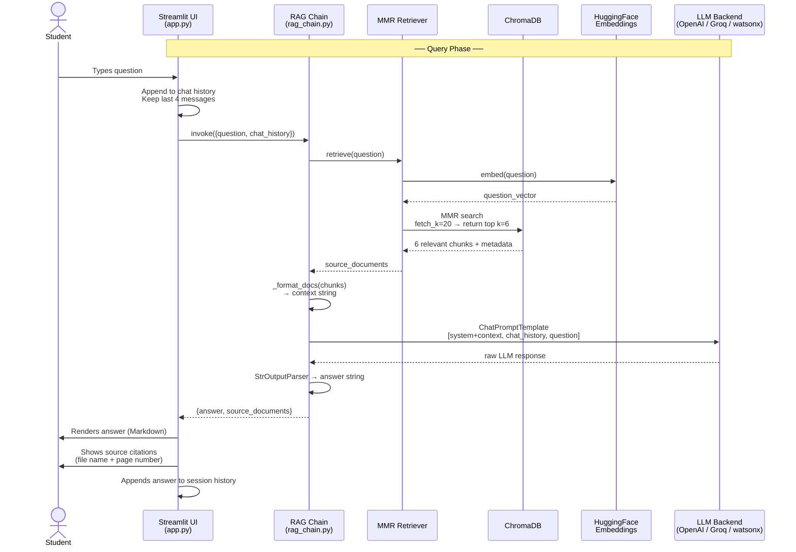
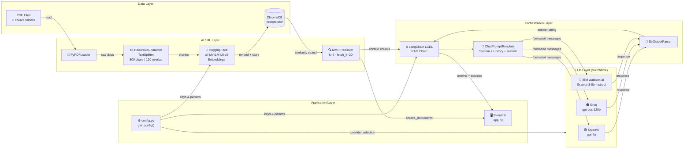
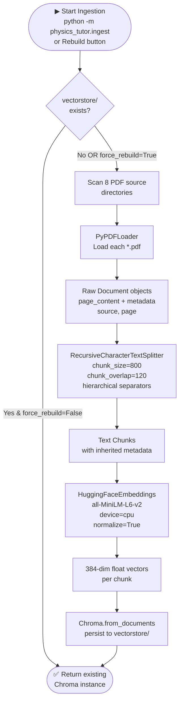
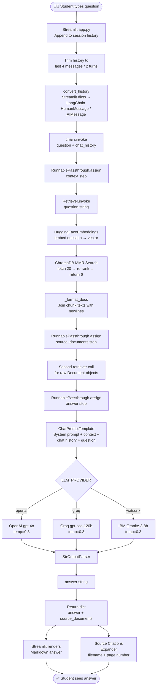
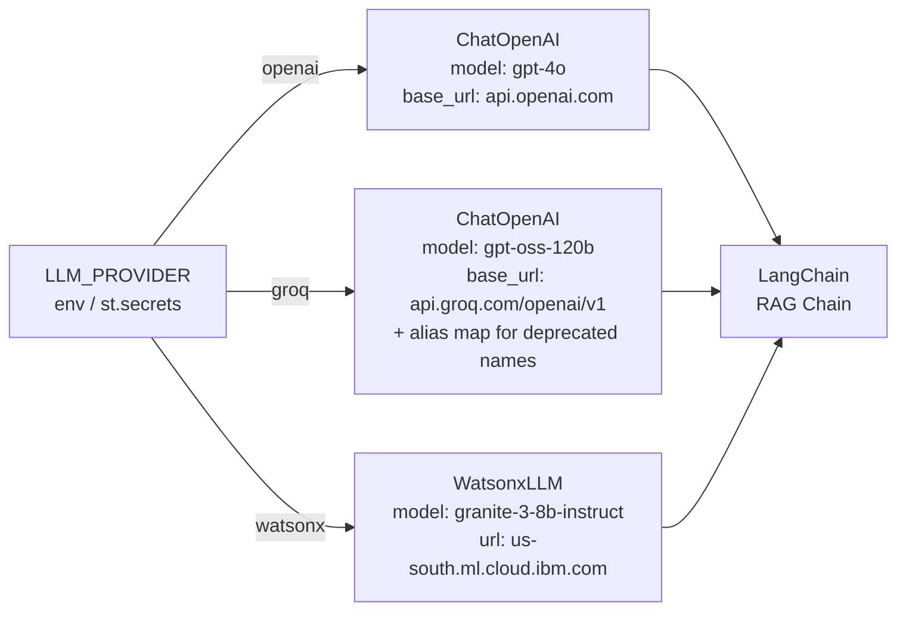

# Physics Tutor RAG — Architecture Documentation

> **Project**: Class 12 CBSE Physics Tutor  
> **Target**: 2027 Board Exam preparation  
> **Stack**: LangChain · ChromaDB · HuggingFace · OpenAI / Groq / IBM watsonx.ai · Streamlit

---

## Table of Contents

1. [Project Overview](#1-project-overview)
2. [Repository Layout](#2-repository-layout)
3. [High-Level Architecture](#3-high-level-architecture)
4. [RAG Pipeline Flow](#4-rag-pipeline-flow)
5. [AI Tools & Components](#5-ai-tools--components)
6. [Component Connection Map](#6-component-connection-map)
7. [Data Flow — Ingestion Phase](#7-data-flow--ingestion-phase)
8. [Data Flow — Query Phase](#8-data-flow--query-phase)
9. [LLM Provider Strategy](#9-llm-provider-strategy)
10. [Configuration & Secrets](#10-configuration--secrets)

---

## 1. Project Overview

The Physics Tutor RAG Agent is a **Retrieval-Augmented Generation (RAG)** system that acts as a personal CBSE Class 12 Physics teacher. It grounds every answer in the student's own study material — NCERT textbooks, Exemplar problems, Notes, PYQs, and Competency-Based Questions — by retrieving semantically relevant chunks before calling the LLM.

**Key capabilities**:
- Conversational Q&A with persistent chat history
- CBSE-pattern question generation (MCQ, HOTS, Assertion-Reasoning, Case-Based)
- Step-by-step derivations and numerical solutions
- Source citations pointing back to specific PDF pages
- Switchable LLM backends (OpenAI, Groq, IBM watsonx.ai) with zero code changes

---

## 2. Repository Layout

```
Physics RAG Project/
├── physics_tutor/               # Application package
│   ├── app.py                   # Streamlit UI entry point
│   ├── config.py                # Centralised configuration & paths
│   ├── ingest.py                # PDF ingestion & vector store builder
│   ├── rag_chain.py             # LangChain LCEL RAG chain + LLM factory
│   ├── __init__.py
│   └── vectorstore/             # Persisted ChromaDB (committed to repo)
│       ├── chroma.sqlite3
│       └── <collection-uuid>/
├── book/
│   ├── leph1dd/                 # NCERT Physics Part 1 PDFs
│   └── leph2dd/                 # NCERT Physics Part 2 PDFs
├── Notes/                       # Chapter-wise teacher notes (PDFs)
├── Exemplar/                    # NCERT Exemplar problem sets (PDFs)
├── PYQ/                         # Previous Year Questions (PDFs)
├── Chapterwise imp questions/   # Important question banks (PDFs)
├── Competency based Questions/  # CBQ / case-study materials (PDFs)
├── Secret Assignment/           # Additional assignment PDFs
├── Ncert Solutions/             # NCERT Chapter-wise exercise solutions (PDFs)
├── SSM Question Paper so far/   # SSM school exam & test question papers (PDFs)
├── .streamlit/
│   ├── config.toml              # UI theme & server settings
│   └── secrets.toml.example     # Secret keys template
├── .env.example                 # Local environment variable template
├── requirements.txt             # Python dependencies
└── README.md
```

---

## 3. High-Level Architecture



---

## 4. RAG Pipeline Flow

This diagram shows the end-to-end lifecycle of a single student question through the RAG system.



---

## 5. AI Tools & Components

### 5.1 Embedding Model — `sentence-transformers/all-MiniLM-L6-v2`

| Attribute | Detail |
|-----------|--------|
| **Library** | `langchain-huggingface` → `HuggingFaceEmbeddings` |
| **Model** | `sentence-transformers/all-MiniLM-L6-v2` |
| **Runs on** | CPU (explicit `device: cpu` to support Streamlit Cloud) |
| **Output** | 384-dimensional normalised float vectors |
| **Purpose** | Converts both PDF text chunks and user questions into the same vector space so similarity search works |
| **Config key** | `EMBEDDING_MODEL` |

**Why this model**: Lightweight (22 M parameters), fast on CPU, and well-suited for English semantic similarity. It produces L2-normalised vectors so cosine similarity is directly usable.

---

### 5.2 Vector Store — ChromaDB

| Attribute | Detail |
|-----------|--------|
| **Library** | `chromadb` + `langchain-chroma` |
| **Persistence** | `physics_tutor/vectorstore/` (committed to repo for Streamlit Cloud) |
| **Retrieval mode** | **MMR** (Maximal Marginal Relevance) — balances relevance with diversity |
| **`k`** | 6 chunks returned to the prompt |
| **`fetch_k`** | 20 candidates fetched before MMR re-ranking |
| **Purpose** | Stores all embedded PDF chunks; serves as the long-term memory of the system |

MMR is specifically chosen here so the retriever does not return six near-identical paragraphs from the same page — it promotes topical coverage across the retrieved context window.

---

### 5.3 PDF Loader — PyPDFLoader

| Attribute | Detail |
|-----------|--------|
| **Library** | `pypdf` + `langchain-community` → `PyPDFLoader` |
| **Input** | All `*.pdf` files across 8 source directories |
| **Output** | `Document` objects carrying `page_content` + `metadata` (`source`, `page`) |
| **Purpose** | Converts raw PDF bytes into LangChain-compatible document objects for the ingestion pipeline |

---

### 5.4 Text Splitter — RecursiveCharacterTextSplitter

| Attribute | Detail |
|-----------|--------|
| **Library** | `langchain` |
| **`chunk_size`** | 800 characters |
| **`chunk_overlap`** | 120 characters |
| **Separators** | `\n\n` → `\n` → `. ` → ` ` → `""` (hierarchical) |
| **Purpose** | Splits large PDF pages into overlapping chunks that fit within the embedding model's context and carry enough context to be useful in retrieval |

The overlap of 120 characters ensures that a concept that straddles a chunk boundary is still findable.

---

### 5.5 LangChain LCEL Pipeline

| Attribute | Detail |
|-----------|--------|
| **Library** | `langchain` (1.x LCEL API) |
| **Pattern** | `RunnablePassthrough.assign` chain |
| **Purpose** | Wires retriever → prompt → LLM → parser into a single composable callable |

The chain executes three sequential `assign` steps:
1. `context` — retrieves and formats source chunks
2. `source_documents` — retrieves raw `Document` objects (for citation display)
3. `answer` — runs prompt → LLM → parser

---

### 5.6 LLM Backends

#### OpenAI — `gpt-4o` (default)

| Attribute | Detail |
|-----------|--------|
| **Library** | `langchain-openai` → `ChatOpenAI` |
| **Default model** | `gpt-4o` |
| **Temperature** | 0.3 (factual, exam-focused) |
| **Max tokens** | 8192 |
| **Config keys** | `OPENAI_API_KEY`, `OPENAI_MODEL` |
| **Purpose** | Primary LLM for generating physics explanations, derivations, and question papers |

#### Groq — `openai/gpt-oss-120b`

| Attribute | Detail |
|-----------|--------|
| **Library** | `langchain-openai` → `ChatOpenAI` (OpenAI-compatible endpoint) |
| **Base URL** | `https://api.groq.com/openai/v1` |
| **Default model** | `openai/gpt-oss-120b` |
| **Temperature** | 0.3 |
| **Max tokens** | 8192 |
| **Max retries** | 3 |
| **Config keys** | `GROQ_API_KEY`, `GROQ_MODEL` |
| **Purpose** | Free-tier alternative LLM backend; includes alias mapping from deprecated Llama/Mixtral model names |

#### IBM watsonx.ai — `ibm/granite-3-8b-instruct`

| Attribute | Detail |
|-----------|--------|
| **Library** | `langchain-ibm` → `WatsonxLLM` · `ibm-watsonx-ai` |
| **Default model** | `ibm/granite-3-8b-instruct` |
| **Endpoint** | `https://us-south.ml.cloud.ibm.com` |
| **Temperature** | 0.3 |
| **Max new tokens** | 8192 |
| **Repetition penalty** | 1.1 |
| **Config keys** | `WATSONX_APIKEY`, `WATSONX_PROJECT_ID`, `WATSONX_URL`, `WATSONX_MODEL_ID` |
| **Purpose** | Enterprise IBM backend; uses IBM Granite instruction-tuned model |

---

### 5.7 Streamlit UI

| Attribute | Detail |
|-----------|--------|
| **Library** | `streamlit` |
| **State management** | `st.session_state` for vector store, RAG chain, and chat history |
| **History window** | Last 4 messages (2 turns) passed to the LLM to limit token usage |
| **Purpose** | Provides the browser-based chat interface, sidebar navigation, source expander, and rebuild controls |

---

## 6. Component Connection Map



---

## 7. Data Flow — Ingestion Phase

This phase runs **once** (or on explicit rebuild) and produces the persisted ChromaDB vector store.



---

## 8. Data Flow — Query Phase

This phase runs on **every student message** at runtime.



---

## 9. LLM Provider Strategy

The system uses a **factory pattern** in [`_build_llm()`](physics_tutor/rag_chain.py) to select the LLM at runtime based on the `LLM_PROVIDER` environment variable. No code changes are needed to switch backends.



| Provider | `LLM_PROVIDER` value | Required secrets | Notes |
|----------|---------------------|-----------------|-------|
| OpenAI | `openai` | `OPENAI_API_KEY` | Default; `gpt-4o` is highly capable for CBSE content |
| Groq | `groq` | `GROQ_API_KEY` | Free tier; includes model alias mapping |
| IBM watsonx.ai | `watsonx` | `WATSONX_APIKEY`, `WATSONX_PROJECT_ID` | Enterprise; uses `WatsonxLLM` (text-generation interface) |

---

## 10. Configuration & Secrets

All configuration is resolved by [`get_config()`](physics_tutor/config.py) using a **three-tier priority chain**:

```
st.secrets  (Streamlit Cloud)
    ↓
os.environ  (local .env via python-dotenv)
    ↓
hardcoded default in config.py
```

### Environment Variables Reference

| Variable | Default | Description |
|----------|---------|-------------|
| `LLM_PROVIDER` | `openai` | Active LLM backend: `openai` \| `groq` \| `watsonx` |
| `OPENAI_API_KEY` | — | OpenAI API key |
| `OPENAI_MODEL` | `gpt-4o` | OpenAI model name |
| `GROQ_API_KEY` | — | Groq API key |
| `GROQ_MODEL` | `openai/gpt-oss-120b` | Groq model name |
| `WATSONX_APIKEY` | — | IBM watsonx.ai API key |
| `WATSONX_PROJECT_ID` | — | IBM watsonx.ai project ID |
| `WATSONX_URL` | `https://us-south.ml.cloud.ibm.com` | watsonx endpoint |
| `WATSONX_MODEL_ID` | `ibm/granite-3-8b-instruct` | Granite model ID |
| `EMBEDDING_MODEL` | `sentence-transformers/all-MiniLM-L6-v2` | HuggingFace embedding model |
| `RETRIEVER_TOP_K` | `6` | Number of chunks returned per query |
| `CHUNK_SIZE` | `800` | Characters per text chunk |
| `CHUNK_OVERLAP` | `120` | Overlap characters between adjacent chunks |

### Local Setup

```bash
cp .env.example .env
# Edit .env with your API keys
streamlit run physics_tutor/app.py
```

### Streamlit Cloud Setup

Add the variables above via **Settings → Secrets** in the Streamlit Community Cloud dashboard (TOML format — see [`.streamlit/secrets.toml.example`](.streamlit/secrets.toml.example)).

### Rebuild the Vector Store

```bash
# Run locally whenever you add new PDFs to source folders
python -m physics_tutor.ingest

# Then commit the updated vectorstore/ directory
git add physics_tutor/vectorstore/
git commit -m "chore: rebuild vector store"
```

The app also exposes a **🔄 Rebuild Vector Store** button in the sidebar for convenience.
